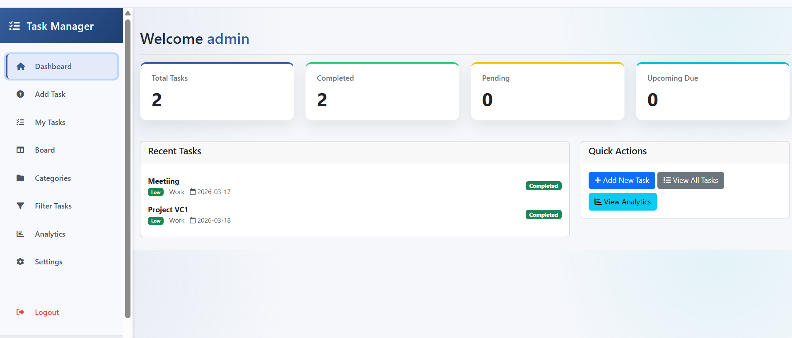

# Talab Reach Portfolio

Personal portfolio website for **Talab Reach**, built with HTML, CSS, and JavaScript.

## Live Sections

- Hero with animated role text
- About me
- Skills with animated progress bars
- Project showcase cards
- References
- Contact form with success feedback
- Light/Dark theme toggle (saved with `localStorage`)

## Tech Stack

- HTML5
- CSS3
- Vanilla JavaScript
- [Boxicons](https://boxicons.com/)
- Google Fonts (Space Grotesk)

## Project Structure

```text
Portfolio_reach/
|- index.html
|- style.css
|- script.js
|- images/
   |- image/
```

## Screenshots

Hero:


Projects:



## Run Locally

1. Clone or download this repository.
2. Open `index.html` in your browser.

Recommended (for best development workflow):

1. Open project in VS Code.
2. Install the **Live Server** extension.
3. Right-click `index.html`.
4. Click **Open with Live Server**.

## Customization Guide

### `index.html`

- Update name, headline, and bio
- Replace social media URLs
- Edit skills, project cards, and references
- Change contact details

### `style.css`

- Adjust colors, spacing, typography, and animation
- Edit responsive breakpoints
- Fine-tune hover and card effects

### `script.js`

- Change rotating/typing role words
- Adjust typing speed and delay
- Theme toggle behavior
- Scroll reveal behavior for cards
- Contact success message timing

## Assets

- Profile and social icons are stored in `images/`
- Project thumbnails and CV image are stored in `images/image/`
- Current CV download source:
  - `images/image/CV (6).jpg`

## Notes

- This is a static portfolio (no backend required).
- For production hosting, you can deploy to Netlify, Vercel, or GitHub Pages.

## License

This project is intended for personal portfolio use.
